# Friday 🌦️

**Friday** is a premium, modern, glassmorphic Android weather assistant designed to keep you updated with clean layouts, live timezone-aware updates, and immersive features.

Built entirely using **Kotlin**, **Jetpack Compose**, and **Clean Architecture (MVVM)**, Friday offers a visually stunning experience styled with custom *Liquid Glass* components, ambient weather soundscapes, and comprehensive metrics.

---

## 🎨 Premium Visuals

Friday leverages **Liquid Glass glassmorphism** styling, dynamic layout transitions, and high-fidelity themes.

<p align="center">
  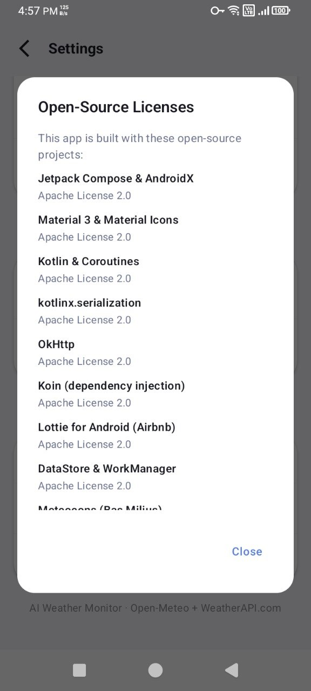
  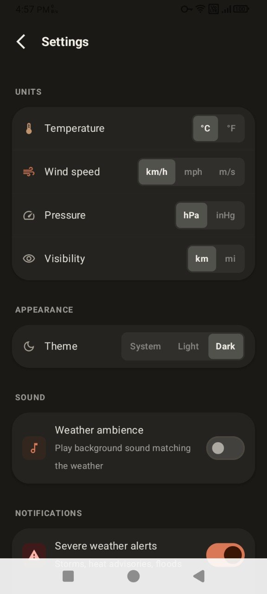
  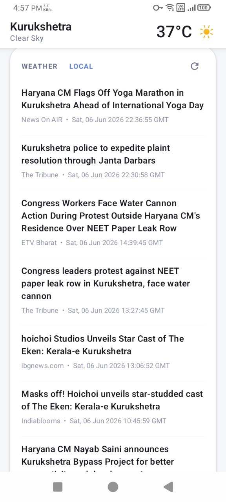
</p>

<details>
<summary>📸 View More Screenshots</summary>

### Onboarding & Setup
<p align="center">
  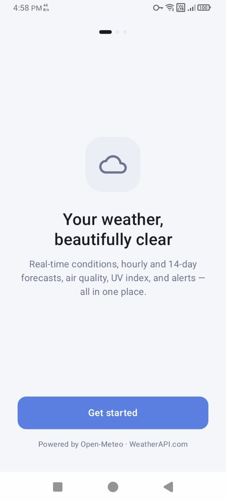
  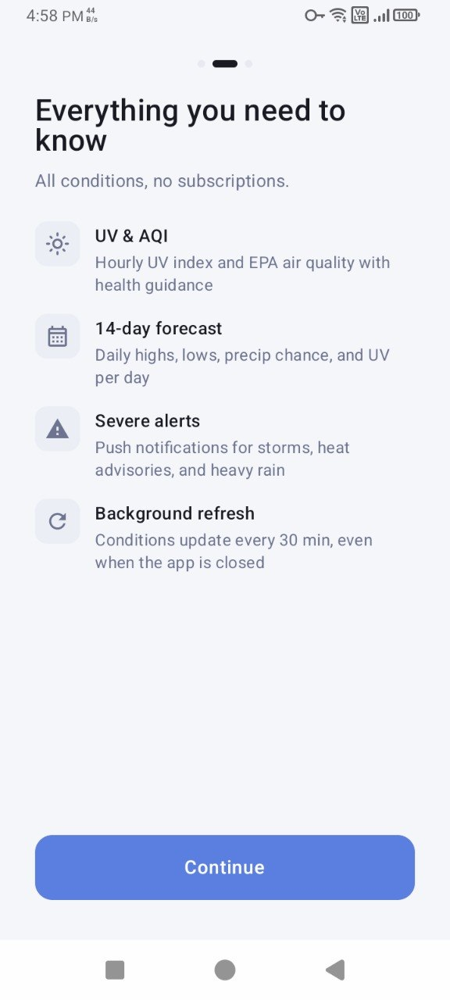
  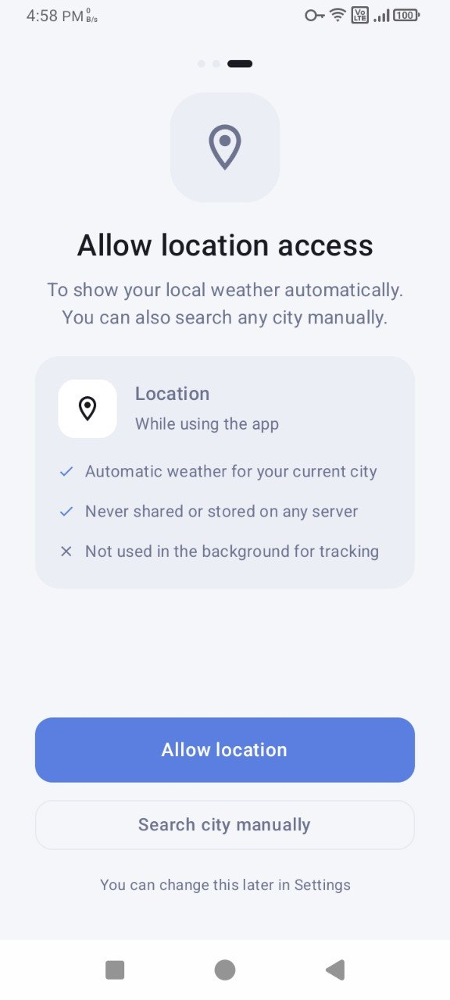
</p>

### Search & Saved Cities
<p align="center">
  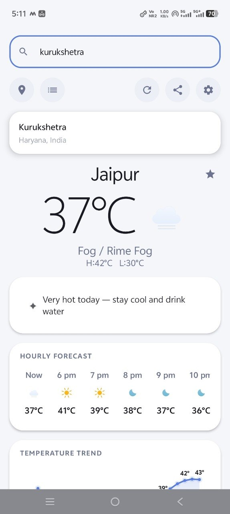
  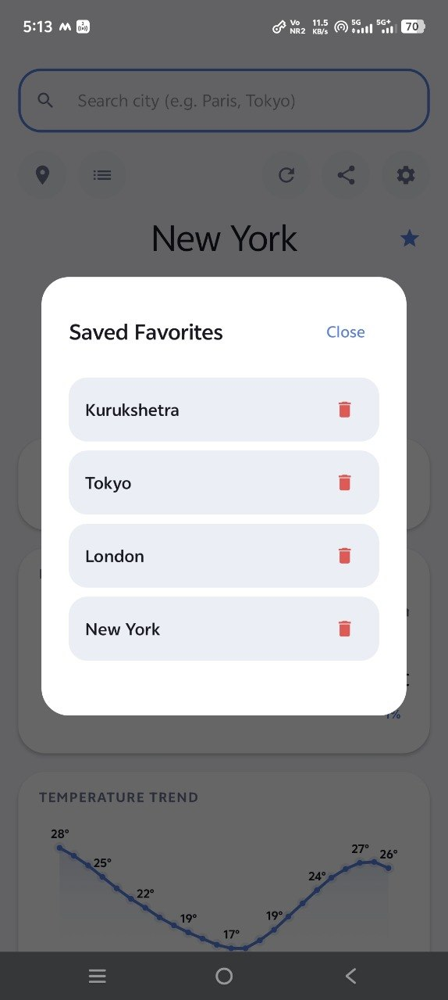
</p>

### Settings & Configurations
<p align="center">
  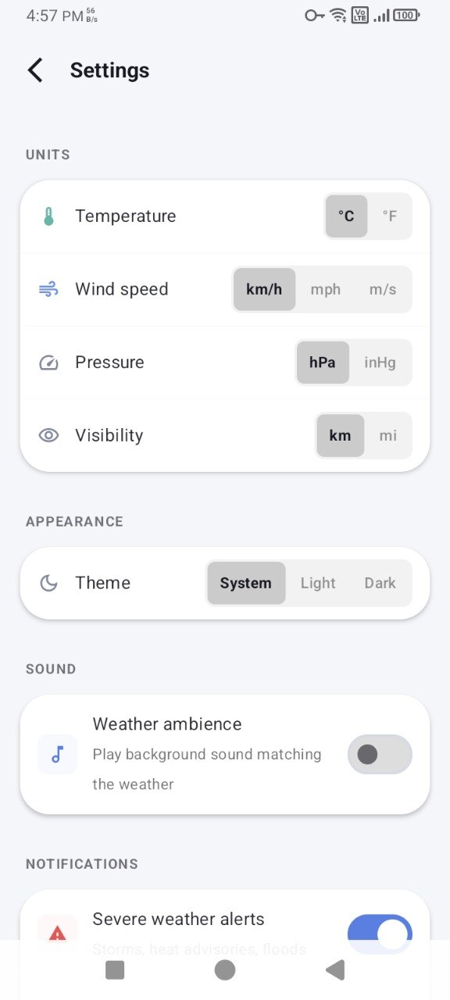
  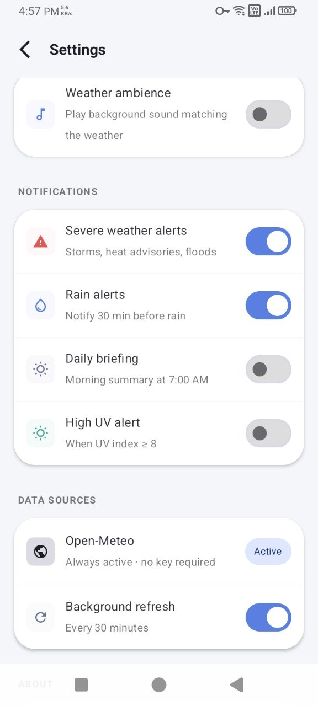
  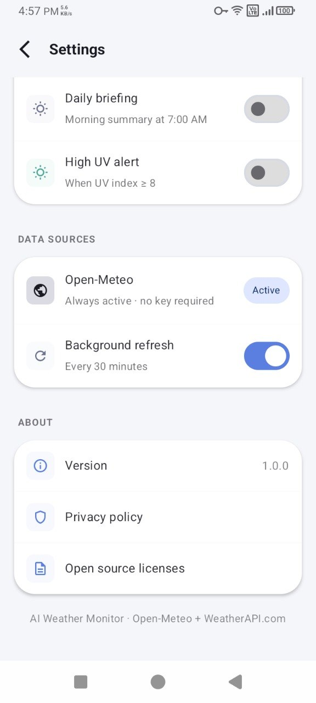
</p>
</details>

---

## 🚀 Key Features

- **Timezone-Aware Live Digital Clock**: Automatically resolves the selected city's local time zone ID and ticks dynamically second-by-second directly below the city name.
- **Glassmorphic Glass-UI Design**: Custom components utilizing frosted glass effects, subtle borders, and vivid gradient backgrounds.
- **Multi-Source Weather Engine**: Utilizes Google Maps / Weather APIs with global fallback support via Open-Meteo.
- **Ambient Weather Soundscapes**: Dynamic audio playbacks (Birds, Rain, Thunder, Wind) matching current weather states.
- **Interactive Home Screen Widget**: Quick-glance forecasts and hourly updates right on your home screen.
- **Smart Weather Notifications**: Local alerts ("Friday Alert") notifying you of critical daily changes.
- **Pollen & Environmental Metrics**: Tracks dust, pollen, and AQI metrics dynamically.

---

## 🛠️ Tech Stack & Architecture

- **Language**: Kotlin 1.9+
- **UI Framework**: Jetpack Compose (Declarative UI)
- **Asynchronous Flow**: Kotlin Coroutines & Flow
- **Data Persistence**: Jetpack DataStore
- **Dependency Inversion**: MVVM (Model-View-ViewModel) architecture
- **Background Tasks**: WorkManager (for background widget updates)
- **Local Soundscapes**: MediaPlayer integrations for seamless loop playback

---

## ⚙️ Getting Started & Configuration

### Prerequisites
- Android Studio (Koala or newer recommended)
- Android SDK 34+
- Gradle JDK 17+

### 🔑 Local Key Setup
To prevent accidental exposure, API credentials are isolated in your `local.properties` file:

1. Clone this repository.
2. In the project root, open or create `local.properties`.
3. Add your Weather API Key:
   ```properties
   WEATHER_API_KEY=YOUR_SECURE_API_KEY_HERE
   ```
4. Build and run.

---

## 📦 Building the App

To compile and check unit tests locally, run:

```bash
# Clean project and run unit tests
./gradlew clean test

# Build debug APK
./gradlew assembleDebug
```
